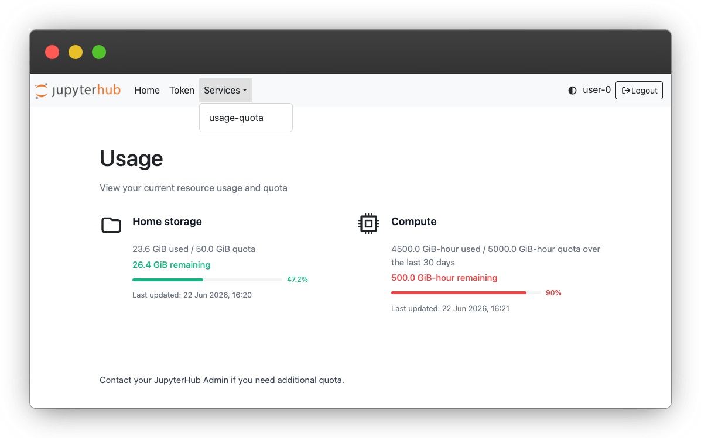
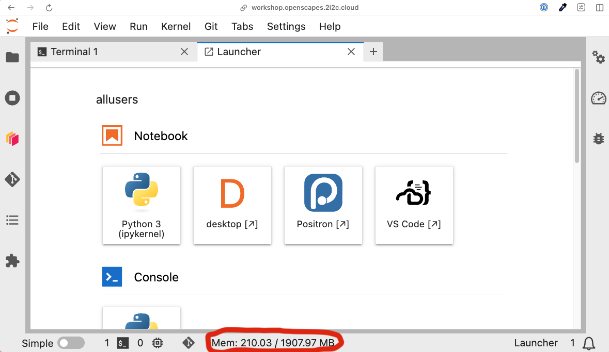

The NASA-Openscapes and NMFS-Openscapes Hubs are shared resources, and every user's storage and compute contributes to our cloud costs.
To keep the Hubs sustainable for everyone, we use [usage quotas](https://2i2c.org/blog/jupyterhub-usage-quotas/) developed by 2i2c to cap the amount of home directory storage and compute resources that each user can use.

## Home directory storage

Your home directory in the hub has a fixed size limit (see below for specific size quotas).
Your home directory is meant for code, notebooks, and small files; where possible data should be streamed for analysis, or stored in an S3 bucket instead.
See our [Data Storage Policies](data-storage.qmd) for tips on managing your storage, and the 2i2c documentation on [storage quotas](https://docs.2i2c.org/user/data/filesystem#filesystem-storage-quotas).

## Compute

Compute usage is measured in **GiB-hours**: the amount of memory (RAM) of the server you selected, multiplied by the number of hours your server is running.
For example, running a ~4 GB server for 10 hours uses about 36 GiB-hours, while running a ~60 GB server for the same 10 hours uses about 600 GiB-hours.

Usage is counted over a rolling 30-day window, so older usage gradually drops off and frees up quota.
If you use up your compute quota, you will not be able to start a new server until enough usage has aged out of the window; the Hub will tell you when you can try again.

## Quotas on the Openscapes Hubs

  | Hub                                                                      | Home directory storage   | Compute (memory requested)             |
  | -----                                                                    | ------------------------ | ----------------------------           |
  | [NASA-Openscapes](https://openscapes.2i2c.cloud/)                        | 30 GiB                   | 5,000 GiB-hours over a rolling 30 days |
  | [NMFS-Openscapes](https://nmfs-openscapes.2i2c.cloud/)                   | 20 GiB                   | 5,000 GiB-hours over a rolling 30 days |
  | [NASA-Openscapes Workshop](https://workshop.openscapes.2i2c.cloud/)      | 10 GiB                   | 5,000 GiB-hours over a rolling 30 days |
  | [NMFS-Openscapes Workshop](https://workshop.nmfs-openscapes.2i2c.cloud/) | 10 GiB                   | 5,000 GiB-hours over a rolling 30 days |

## Checking your usage

You can see your current storage and compute usage at any time in the usage dashboard:

1. Go to the Hub Control Panel: [NASA](https://openscapes.2i2c.cloud/hub/home) or [NMFS](https://nmfs-openscapes.2i2c.cloud/hub/home).
   If you are already in JupyterLab, select **File > Hub Control Panel**.
2. Open the **Services** menu in the top navigation bar and select **usage-quota**.

The dashboard shows how much of each quota you have used and how much remains.
The progress bars turn red when you have used more than 90% of a quota.
See the 2i2c [usage and quota dashboard documentation](https://docs.2i2c.org/user/usage-quota-dashboard/) for more details.

{fig-alt="JupyterHub usage dashboard showing home storage at 23.6 of 50 GiB used and compute at 4,500 of 5,000 GiB-hours used, with the compute bar shown in red at 90%."}

## Choosing the right server size

When you start your server, you choose a server size (for example, "~4 GB RAM, ~0.5 CPUs").
**We are charged for the size you select, not for what you actually use.** For example, a ~15 GB server counts as ~15 GB for every hour it runs, even if your notebook only uses 2 GB of it.
Choosing a server that is larger than you need wastes money and uses up your quota faster.

As a guide, here is roughly what each server size costs, and how long it can run before using the full 5,000 GiB-hour quota in a 30-day window:

```{r}
#| label: server-size-costs

library(httr2)
library(yaml)
library(knitr)

compute_quota_gib_hours <- 5000
hours_per_day <- 8

# The NASA and NMFS hubs have the same server sizes, use NASA's config.
config_url <- "https://raw.githubusercontent.com/2i2c-org/infrastructure/main/config/clusters/openscapeshub/common.values.yaml"

# Memory values exceed R's integer range, so integers are parsed as doubles.
config <- yaml::read_yaml(
  config_url,
  handlers = list(int = function(x) as.numeric(x))
)
choices <- config$basehub$jupyterhub$singleuser$profileList[[
  1
]]$profile_options$resource_allocation$choices

sizes <- data.frame(
  size = vapply(choices, \(x) sub(" RAM.*", "", x$display_name), character(1)),
  mem_gib = vapply(
    choices,
    \(x) x$kubespawner_override$mem_guarantee / 1024^3,
    numeric(1)
  ),
  instance_type = vapply(
    choices,
    \(x) {
      x$kubespawner_override$node_selector[["node.kubernetes.io/instance-type"]]
    },
    character(1)
  )
)

# This is the unauthenticated endpoint behind the AWS EC2 pricing page. The
# official Price List API either requires credentials or serves a ~500 MB file.
price_url <- "https://b0.p.awsstatic.com/pricing/2.0/meteredUnitMaps/ec2/USD/current/ec2-ondemand-without-sec-sel/US%20West%20(Oregon)/Linux/index.json"
prices <- request(price_url) |>
  req_perform() |>
  resp_body_json()
price_rows <- unlist(prices$regions, recursive = FALSE)
instance_prices <- vapply(
  unique(sizes$instance_type),
  \(type) {
    row <- Find(\(x) identical(x[["Instance Type"]], type), price_rows)
    as.numeric(row$price)
  },
  numeric(1)
)

# Each server reserves a fixed share of its node's memory, and the largest
# size on each instance type fills the whole node. A server's cost is
# therefore its share of the node's hourly price.
node_mem_gib <- ave(sizes$mem_gib, sizes$instance_type, FUN = max)
sizes$cost_per_hour <- sizes$mem_gib /
  node_mem_gib *
  instance_prices[sizes$instance_type]
sizes$quota_hours <- compute_quota_gib_hours / sizes$mem_gib
sizes$hours_per_day <- pmin(sizes$quota_hours / 30, 24)

price_date <- as.Date(prices$manifest$hawkFilePublicationDate)

table <- data.frame(
  "Server size" = sizes$size,
  "Cost per hour" = sprintf("\\$%.2f", sizes$cost_per_hour),
  "Cost per day" = sprintf("\\$%.2f", sizes$cost_per_hour * hours_per_day),
  "Hours before reaching quota" = paste0(
    "~",
    format(signif(sizes$quota_hours, 2), big.mark = ",", trim = TRUE)
  ),
  check.names = FALSE
)
names(table)[3] <- sprintf("Cost per %d-hour day", hours_per_day)

knitr::kable(table, align = "lrrr")
```

Costs are estimated from the AWS on-demand price (as of `r format(price_date, "%B %Y")`) of the machines the Hubs run on, in proportion to the share of the machine each server size reserves.
They do not include storage, data transfer, or the Hub's shared infrastructure, so actual costs are somewhat higher.
Using your full compute quota costs roughly \$`r round(mean(sizes$cost_per_hour * sizes$quota_hours))`, whichever server size you choose.

Tips for choosing the right size:

- **Start small.** The smallest server is enough for most work, including workshops, writing code, and exploring data.
  Only move up if you run out of memory.
- **Watch your memory use.** The memory indicator at the bottom of JupyterLab shows how much memory you are using.
  If you are consistently using under half of your server's memory, try choosing a smaller size.
  {fig-alt="JupyterLab memory usage indicator showing 287 MB of 2 GB used."}
- If your session restarts or crashes unexpectedly while loading or processing data, you have probably run out of memory.
  Try the next size up.
- **Use large servers only when you need them.** If you have a short, memory intensive task, start a large server for that task, then shut it down and go back to a smaller one for the rest of your work.
- **Shut down your server when you are done.** Your server keeps counting against your quota while it is running, even if you are not using it.
  Use **File > Hub Control Panel > Stop My Server** rather than just closing your browser tab.
  Servers are shut down automatically after a period of inactivity, but stopping them yourself is a good idea.
- **Work in chunks.** Processing data in smaller pieces (for example, by time step or region) or loading data lazily (e.g., with `xarray` and `dask`) often lets you use a much smaller server.

If your work needs large or long-running compute, please [open an issue](https://github.com/openscapes/openscapes.cloud/issues) to talk to the Openscapes Team.
